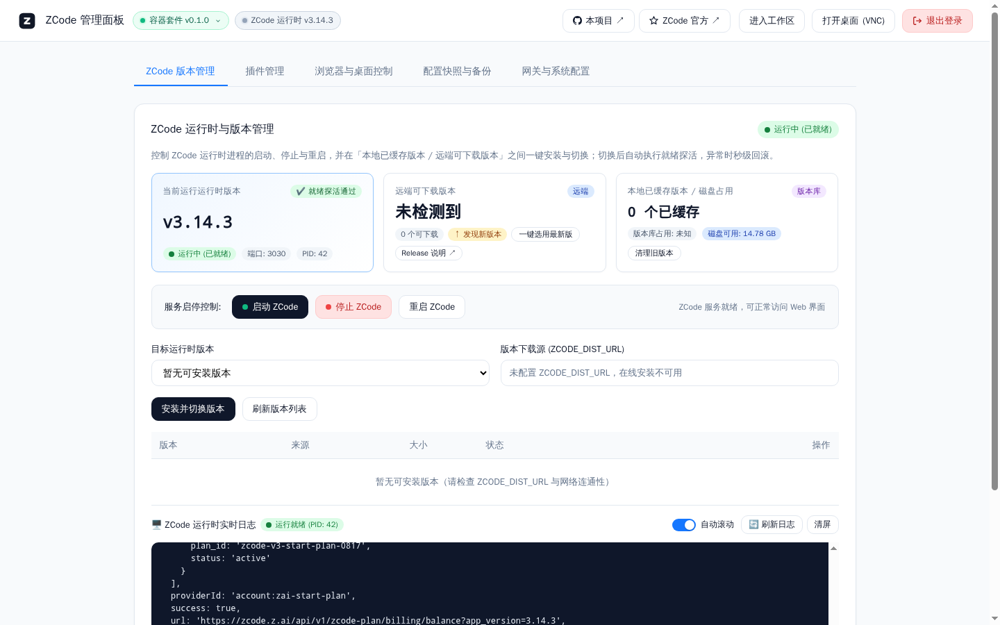
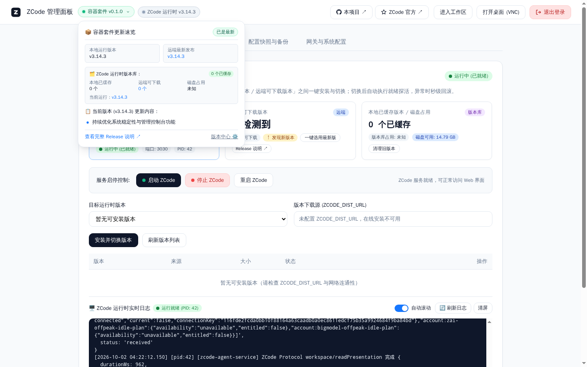
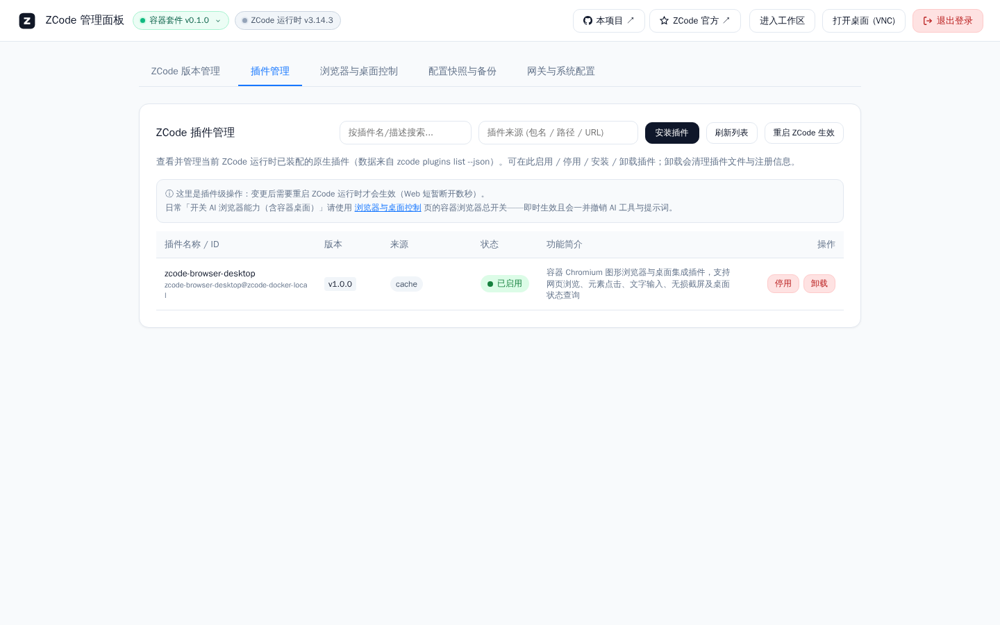
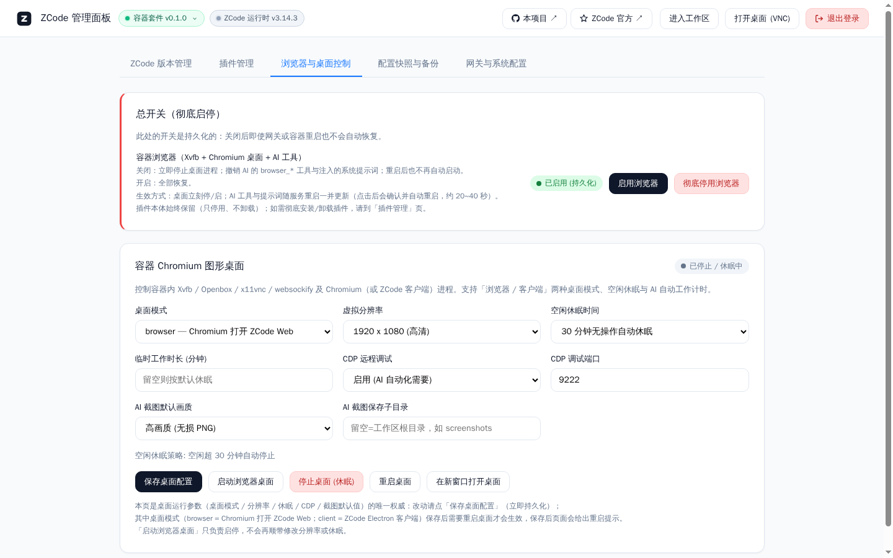
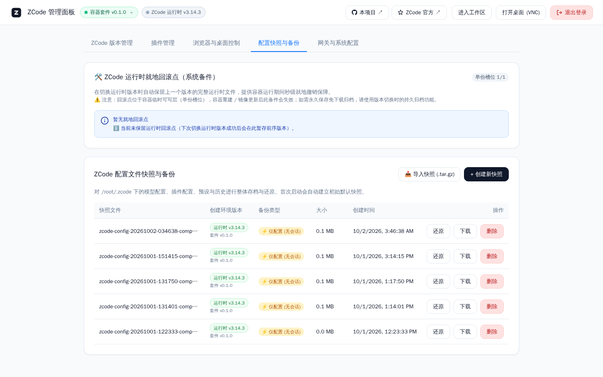
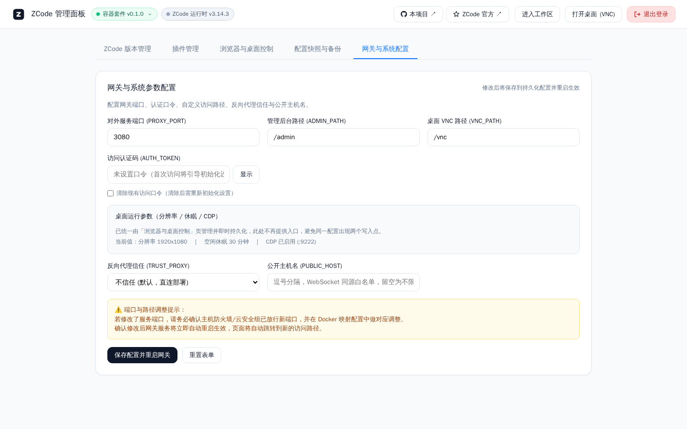
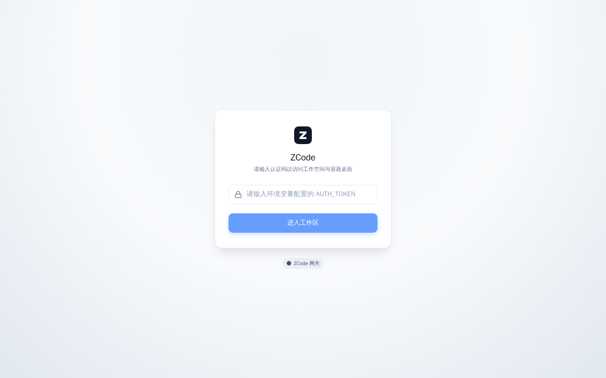
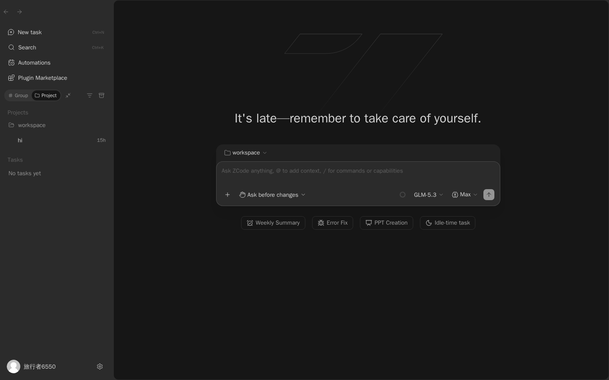
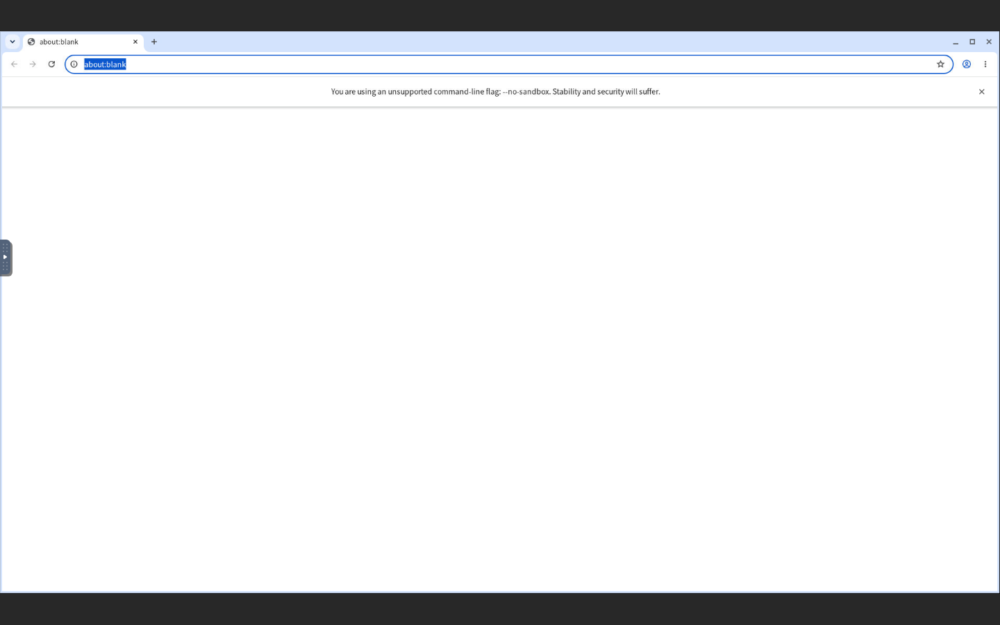

# zcode-docker

> 📌 **版本信息**：内置官方 ZCode 核心 `3.14.3` ｜ 本项目工程版本 `0.1.1`
> 🔗 **快速直达链接**：
> - ⚡ **官方 ZCode 仓库**：[zai-org/ZCode](https://github.com/zai-org/ZCode) ｜ [官方 Releases](https://github.com/zai-org/ZCode/releases)
> - 📦 **本项目 Docker 仓库**：[misaka-link/zcode-docker](https://github.com/misaka-link/zcode-docker) ｜ [本项目 Releases](https://github.com/misaka-link/zcode-docker/releases) ｜ [GHCR 镜像包页](https://github.com/misaka-link/zcode-docker/pkgs/container/zcode-docker)
> 🏷️ **镜像标签规范**：默认拉取镜像统一保持 **`:latest`**，开箱即用；每次构建镜像时**均会额外多打两组版本标签**：
> 1. **内置官方 ZCode 版本标签**（如 `:zcode-3.14.3`、`:3.14.3`），精确锁定底层 ZCode 引擎；
> 2. **本项目自身工程版本标签**（如 `:0.1.1`、`:v0.1.1`），精确锁定本容器套件自身的版本。

面向官方 [ZCode](https://github.com/zai-org/ZCode)（Z.ai 出品的 AI 编程工作台）打造的**开箱即用容器化套件与可视化 Web Admin 控制台**。基于 **Debian Trixie & Node 24** 现代运行时底座，**一个端口**同时提供 **ZCode Web 工作区 / Web 管理控制台 / noVNC 虚拟桌面** 三入口；内置轻量访问认证与初始化向导、配置快照与一键还原、ZCode 运行时多版本在线热切换、容器内真实 Chromium 桌面与 AI 浏览器插件。

简单来说：**单端口三入口，自带强大 Admin 控制台，Docker 一键梭哈，开箱即用。**

---

## 🎛️ 核心亮点：强大好用的 Web Admin 控制台展示

本项目核心特色在于内置了功能完备、极简美观的 Web 管理控制台（访问 `/admin/` 即可进入）：

| 1. ZCode 运行时与版本管理看板 | 2. 顶栏容器套件更新速览 |
| :---: | :---: |
|  |  |
| 实时呈现当前运行时版本、探活状态、端口与 PID，并在「本地已缓存版本 / 远端可下载版本」之间一键安装与切换；切换前自动就地回滚点 | 点击顶栏版本徽章弹出更新速览卡片，展示本地/远端版本、运行时版本库缓存、当前版本更新内容与官方 Release 直达 |

| 3. 原生插件管理 | 4. 浏览器与虚拟桌面控制 |
| :---: | :---: |
|  |  |
| 直接驱动 `zcode plugins list/install/enable/disable/uninstall`；自带 `zcode-browser-desktop` 原生插件，镜像内置、启动自动安装（开箱即用） | 浏览器/客户端两种桌面模式、1080p/2K 分辨率、空闲自动休眠、CDP 9222 远程调试开关、AI 截图默认画质与保存目录 |

| 5. 配置快照与一键备份还原 | 6. 网关与系统安全配置 |
| :---: | :---: |
|  |  |
| 一键生成 `/root/.zcode` 全量快照，支持还原（仅配置 / 完整全量）、下载归档、导入外部快照与单槽位就地回滚点 | 热修改访问认证码、自定义后台与桌面路径、反向代理信任、WebSocket 同源白名单，改完自动重启网关生效 |

| 7. 极简访问认证页 | 8. 官方 ZCode Web 交互工作区 |
| :---: | :---: |
|  |  |
| 告别原生丑陋 Basic Auth 弹窗，ZCode 同源灰白科技质感，单输入框极速登录；留空口令则首次访问进初始化向导 | 彻底打通容器内回环限制，浏览器直接使用完整 ZCode 工作台：任务会话、项目、插件市场与内置模型一应俱全 |

| 9. 容器内置真实 Chromium noVNC 桌面 (`/vnc/`) | 10. 控制台顶栏与三入口直达 |
| :---: | :---: |
|  |  |
| Xvfb + x11vnc + websockify 静态版本化隔离；**默认打开干净空白页**，可用 `ZCODE_DESKTOP_START_URL` 指定 ZCode Web 或任意网址，也可切换为 ZCode 官方 Electron 客户端 | 顶栏常驻「本项目 / ZCode 官方」仓库直达、「进入工作区」「打开桌面 (VNC)」与退出登录，一个口令贯通三入口 |

---

## 📦 镜像版本选择与标签说明

直接使用已发布的预构建镜像即可，**无需源码、无需构建**。所有标签指向同一镜像，按需选择：

| 标签 | 含义 |
| --- | --- |
| `ghcr.io/misaka-link/zcode-docker:latest` | **最新构建（推荐）** |
| `ghcr.io/misaka-link/zcode-docker:0.1.1` / `:v0.1.1` | 本项目工程版本标签，精确锁定套件版本 |
| `ghcr.io/misaka-link/zcode-docker:zcode-3.14.3` / `:3.14.3` | 内置 ZCode 官方引擎版本标签，精确锁定底层运行时 |

---

## 🚀 Docker 一键梭哈

### 1. 环境要求

- Docker Engine 24+（含 BuildKit）、Docker Compose v2+
- **直接使用预构建镜像**：只要 Docker，无需源码、无需构建（推荐）
- **从源码构建镜像**：见下方「6. 从源码构建镜像」，需能访问 GitHub 与 npm 源，内存建议 ≥ 4 GB

### 2. 单行命令极速启动（推荐）

```bash
docker run -d \
  --name zcode \
  --restart unless-stopped \
  -p 3080:3080 \
  -e AUTH_TOKEN=your-strong-token \
  -v $(pwd)/data/zcode:/root/.zcode \
  -v $(pwd)/workspace:/workspace \
  -v $(pwd)/data/snapshots:/root/.zcode-snapshots \
  -v $(pwd)/data/browser:/root/.config/chromium \
  ghcr.io/misaka-link/zcode-docker:latest
```

> `AUTH_TOKEN` 也可以留空：首次访问会自动进入「初始化访问口令」向导，设置后以 `0600` 持久化到数据卷。
> 想锁定版本，把末尾标签换成 `:0.1.1`（套件版本）或 `:zcode-3.14.3`（内置 ZCode 版本）即可。

### 3. Docker 容器编排（docker-compose）

最小可用版 `docker-compose.yml`（默认拉取已发布的 GHCR 镜像，无需本地构建）：

```yaml
services:
  zcode:
    image: ghcr.io/misaka-link/zcode-docker:latest
    container_name: zcode
    restart: unless-stopped
    ports:
      # 仅暴露单个统一端口（包含 ZCode Web 工作区、管理控制台与 VNC 桌面）
      - "3080:3080"
    environment:
      # 访问认证口令（用于登录 Web 工作区、管理控制台与 VNC 桌面）
      # 留空时：首次访问会自动引导至「初始化访问口令」向导，设置后持久化至数据卷
      - AUTH_TOKEN=your-strong-token
      # 统一对外端口（需与上面的端口映射保持一致）
      - PROXY_PORT=3080
      # 虚拟桌面总开关（1: 开启, 0: 关闭）与模式（browser: 容器内置 Chromium; client: Electron 客户端）
      - ZCODE_DESKTOP_ENABLED=1
      - ZCODE_DESKTOP_MODE=browser
    volumes:
      - ./data/zcode:/root/.zcode
      - ./workspace:/workspace
      - ./data/snapshots:/root/.zcode-snapshots
      - ./data/browser:/root/.config/chromium
```

> 仓库根目录的 [`docker-compose.yml`](docker-compose.yml) 是**完整版**：所有可调项都改由 `.env` 注入（`${AUTH_TOKEN:-}` 形式），
> 并附带容器安全加固（`no-new-privileges` + `cap_drop: ALL`）与全部可选参数注释；直接 `docker compose up -d` 即可用。

启动：

```bash
# 方式 A：克隆仓库后直接起
git clone https://github.com/misaka-link/zcode-docker.git && cd zcode-docker
cp .env.example .env                        # 环境配置文件：至少设置 AUTH_TOKEN（见下节）
mkdir -p data/zcode data/snapshots data/browser workspace
docker compose up -d

# 方式 B：只取编排文件与配置模板（不需要源码）
mkdir -p zcode-docker && cd zcode-docker
curl -fsSLO https://raw.githubusercontent.com/misaka-link/zcode-docker/main/docker-compose.yml
curl -fsSL  https://raw.githubusercontent.com/misaka-link/zcode-docker/main/.env.example -o .env
mkdir -p data/zcode data/snapshots data/browser workspace
docker compose up -d

# 查看状态与日志
docker compose ps          # 应显示 (healthy)
docker compose logs -f
```

要点：

- `PROXY_PORT` 同时决定 **宿主映射端口** 与 **容器内监听端口**，改一处即可（避免映射错位）。
- 数据落在 `./data/*` 与 `./workspace`，容器重建/升级镜像不丢数据。
- 容器内置 `HEALTHCHECK`（`/healthz`），`docker compose ps` 直接可见健康状态。
- 升级：`docker compose pull && docker compose up -d`。
- 想用**本地构建**的镜像：先 `./build.sh`（默认打 `ghcr.io/misaka-link/zcode-docker` 标签，compose 直接复用），
  或在 `.env` 里设置 `ZCODE_IMAGE=zcode-docker:latest`。

### 4. 环境配置文件（`.env`）

`docker compose` 会自动读取同目录下的 **`.env`** 作为变量来源（compose 里的 `${AUTH_TOKEN:-}`、`${PROXY_PORT:-3080}` 等均取自它）。
仓库自带模板 [`.env.example`](.env.example)，复制一份即可：

```bash
cp .env.example .env
vi .env        # 至少设置 AUTH_TOKEN；端口 / 工作区 / 桌面等按需修改
```

`.env` 常用配置项（**完整清单见 [`.env.example`](.env.example)**）：

| 配置项 | 默认值 | 说明 |
| --- | --- | --- |
| `AUTH_TOKEN` | *空* | 统一访问口令（Web / 控制台 / VNC 共用）；留空 → 首次访问进初始化向导 |
| `PROXY_PORT` | `3080` | 唯一对外端口（宿主映射与容器内监听同值） |
| `ZCODE_WORKSPACE` | `/workspace` | AI 编程工作区目录 |
| `ZCODE_BROWSE_ROOT` | `/workspace` | 「添加项目」目录浏览器默认起始目录 |
| `ZCODE_DESKTOP_ENABLED` | `1` | 虚拟桌面总开关（设 `0` 可省内存） |
| `ZCODE_DESKTOP_MODE` | `browser` | `browser`（容器内 Chromium）\| `client`（Electron 客户端） |
| `ZCODE_DESKTOP_START_URL` | *空* | 桌面浏览器起始地址：空=`about:blank`；`zcode`=容器内 ZCode Web；`http(s)://…`=指定网址 |
| `ZCODE_IDLE_TIMEOUT_MINUTES` | `30` | 桌面空闲休眠（`0`=不休眠） |
| `ADMIN_PATH` / `VNC_PATH` | `/admin` / `/vnc` | 控制台与虚拟桌面访问路径 |
| `HTTP_PROXY` / `HTTPS_PROXY` / `NO_PROXY` | *空* | 出站网络代理（按需配置） |
| `ZCODE_IMAGE` | `ghcr.io/misaka-link/zcode-docker:latest` | compose 使用的镜像；改成本地构建的 `zcode-docker:latest` 即可离线部署 |

> **用 `docker run` 时没有 `.env`**：把上表配置项改写成 `-e KEY=VALUE` 传给容器即可（见「2. 单行命令极速启动」）。
> 未在 `.env` 里出现的项一律使用镜像内置默认值，因此**最小可用配置只需一个 `AUTH_TOKEN`**（留空则走初始化向导）。

### 5. 启动后访问

| 入口 | 地址 | 说明 |
| :--- | :--- | :--- |
| **Web 工作区（ZCode）** | `http://<服务器IP>:3080/` | 完整 ZCode 工作台 |
| **管理控制台** ⭐ | `http://<服务器IP>:3080/admin/` | 版本 / 插件 / 桌面 / 快照 / 设置五大面板 |
| **虚拟桌面（noVNC）** | `http://<服务器IP>:3080/vnc/` | 容器内 Chromium 桌面，默认空白页 |

### 6. 从源码构建镜像（可选）

```bash
git clone https://github.com/misaka-link/zcode-docker.git && cd zcode-docker
./build.sh                    # 默认走国内镜像源加速；海外构建用 ./build.sh --china-mirror=0
# 常用参数：--no-cache / --with-desktop-client / --dist-url <预构建发行包URL> / --ref v3.14.3
docker compose up -d
```

---

## ⚙️ 常见环境变量

| 变量名 | 默认值 | 说明 |
| --- | --- | --- |
| `AUTH_TOKEN` | *空* | 统一访问口令；留空则首次访问进入初始化向导并持久化 |
| `PROXY_PORT` | `3080` | 唯一对外端口（Web、控制台与 VNC 共用） |
| `ADMIN_PATH` / `VNC_PATH` | `/admin` / `/vnc` | 管理后台与图形桌面访问路径 |
| `ZCODE_HOME` | `/root` | 运行根目录（非 root 部署可改 `/home/zcode`） |
| `ZCODE_WORKSPACE` | `/workspace` | AI 默认工作区目录 |
| `ZCODE_BROWSE_ROOT` | `/workspace` | 「添加项目」目录浏览器默认起始目录 |
| `ZCODE_DESKTOP_ENABLED` | `1` | 是否启用虚拟桌面（`1` 开启 / `0` 关闭） |
| `ZCODE_DESKTOP_MODE` | `browser` | 桌面模式：`browser`（容器 Chromium）/ `client`（Electron 客户端） |
| `ZCODE_DESKTOP_START_URL` | *空* | 桌面起始地址：空=`about:blank`、`zcode`=容器内 ZCode Web、`http(s)://…`=指定网址 |
| `ZCODE_DESKTOP_WIDTH` / `ZCODE_DESKTOP_HEIGHT` | `1920` / `1080` | 桌面分辨率（控制台可动态调整） |
| `ZCODE_IDLE_TIMEOUT_MINUTES` | `30` | 桌面空闲自动休眠（`0` 为不休眠） |
| `ZCODE_BUILTIN_PLUGINS` | `1` | 内置插件（`zcode-browser-desktop`）启动时自动首装/升级开关（设 `0` 关闭） |
| `ZCODE_ENABLE_CDP` / `ZCODE_CDP_PORT` | `1` / `9222` | 容器 Chromium 远程调试开关与端口 |
| `ZCODE_SCREENSHOT_QUALITY` / `ZCODE_SCREENSHOT_DIR` | `high` / *空* | AI 截图默认画质与保存子目录 |
| `ZCODE_DIST_URL` | *空* | 运行时版本在线下载基址；留空则禁用在线安装（只读当前版本） |
| `ZCODE_VERSIONS_MIN_FREE_MB` | `1536` | 版本切换前磁盘可用空间水位要求 |
| `ZCODE_INTERNAL_TOKEN` | `0` | `1` 时网关为上游注入内部令牌（`?token=` + `zcode_lite_token` Cookie） |
| `TRUST_PROXY` / `PUBLIC_HOST` | `0` / *空* | 反向代理信任与 WebSocket 同源白名单 |
| `HTTP_PROXY` / `HTTPS_PROXY` / `ALL_PROXY` / `NO_PROXY` | *空* | 出站网络代理（自动大小写归一化） |

---

## 🧩 自带插件：`zcode-browser-desktop`（ZCode 原生）

把容器浏览器与虚拟桌面能力封装为 **ZCode 原生插件**（MCP 工具 + Skill，零第三方依赖），
Agent 可直接调用：`browser_status` / `browser_open` / `browser_screenshot` / `browser_click` / `browser_type` / `browser_wait`。

**开箱即用**：插件已内置进镜像（`/opt/zcode-docker/plugins` 本地插件市场），容器每次启动时由
entrypoint（第 10.5 步）在网关拉起前自动完成幂等首装/升级，无需手动安装、无需重启生效；
已装同版本或更新版本则自动跳过，绝不改动用户自选来源与启用位。如需关闭该行为，设置
环境变量 `ZCODE_BUILTIN_PLUGINS=0`。

```bash
# 1) 本地校验插件清单（ZCode 原生规范，可选）
bash scripts/validate-browser-plugin.sh

# 2) 查看容器内已安装插件
docker exec zcode node /opt/zcode/bin/zcode.mjs plugins list --json
```

启动后即可在控制台「插件管理」页看到 `zcode-browser-desktop`（状态：已启用）。
详见 [`plugins/zcode-browser-desktop/README.md`](plugins/zcode-browser-desktop/README.md)。

---

## 🏗️ 架构与数据卷

```
                        宿主机 :3080（唯一暴露端口）
                                  │
        ┌─────────────────────────▼──────────────────────────┐
        │  gateway（Node，http + http-proxy，无框架）          │
        │  · 统一认证：登录页 / 会话 Cookie / 首次初始化向导     │
        │  · /            → ZCode Web   (127.0.0.1:3030)       │
        │  · /admin/      → Web 控制台（静态 + REST API）        │
        │  · /vnc/        → noVNC → x11vnc → Xvfb :99          │
        │  · /healthz、/logout、/__api/desktop/*、内部接口       │
        └───┬──────────────────────┬───────────────────┬──────┘
            │                      │                   │
   ZCode Web (3030)         控制台 API / 静态      虚拟桌面 :99
   zcode-manager 守护       快照 / 版本 / 插件      ├─ browser：Chromium
   （探活 + 自愈 + 日志）                          └─ client ：ZCode Electron 客户端
```

| 数据卷 | 容器内路径 | 用途 |
| :--- | :--- | :--- |
| `./data/zcode` | `/root/.zcode` | ZCode 配置、会话历史与扩展状态 |
| `./workspace` | `/workspace` | AI 工作区（生成的项目代码与文档） |
| `./data/snapshots` | `/root/.zcode-snapshots` | 配置快照与多版本运行时归档 |
| `./data/browser` | `/root/.config/chromium` | 容器 Chromium 用户数据（登录态 / Cookies） |

---

## 🧪 开发与验证

本仓库自带可复现的验证链路（脚本均在 [`scripts/`](scripts/)）：

| 脚本 | 作用 | 需要 Docker |
| :--- | :--- | :---: |
| [`local-build-zcode.sh`](scripts/local-build-zcode.sh) | 在本机构建 ZCode 发行包，产物落 `.build/zcode-<v>.tar.gz` | 否 |
| [`e2e-local.sh`](scripts/e2e-local.sh) | 本地等效端到端：真实网关 + 真实上游，覆盖认证/反代/控制台 API/快照全链路 | 否 |
| [`desktop-logic-test.mjs`](scripts/desktop-logic-test.mjs) | 虚拟桌面编排逻辑（桩进程）：启动顺序、browser/client 模式、起始地址、热更新重启 | 否 |
| [`validate-browser-plugin.sh`](scripts/validate-browser-plugin.sh) | 用 ZCode CLI 校验自带插件清单 | 否 |
| [`patch-zcode-runtime.mjs`](scripts/patch-zcode-runtime.mjs) | 构建期给运行时打最小补丁（`ZCODE_BROWSE_ROOT` 默认目录），幂等、可容忍失配 | 否 |

```bash
bash scripts/local-build-zcode.sh     # 1) 构建 ZCode 发行包
bash scripts/e2e-local.sh             # 2) 网关等效 E2E
node scripts/desktop-logic-test.mjs   # 3) 桌面编排逻辑测试
bash scripts/validate-browser-plugin.sh
```

镜像级验收：在任意具备 Docker 的机器上执行 `./build.sh && docker compose up -d`，
然后按上方三个入口人工验证；`/healthz` 可用于自动化探活（容器已内置 `HEALTHCHECK`）。

当前验证基线：本地等效 E2E **27/27**、桌面编排逻辑 **33/33**、远程镜像验收 **18/18**、
`docker compose` 编排验收 **19/19**、运行时在线安装/切换 **11/11**。

---

## 📝 版本更新历史 (Changelog)

### v0.1.2

- ✨ **内置插件开箱即用**：`zcode-browser-desktop` 插件随镜像内置（`/opt/zcode-docker/plugins` 本地插件市场），容器启动时由 entrypoint 在网关拉起前自动完成幂等首装/升级（同版本/更新版本自动跳过，不触碰启用位），部署后无需手动 `marketplace add` + `plugins install` 两步安装；环境变量 `ZCODE_BUILTIN_PLUGINS=0` 可关闭。

### v0.1.1

- 🐛 **修复浏览器插件截图失效**：`zcode-browser-desktop` 的 `browser_screenshot` 因 `tools.mjs` 漏导入 `isCdpAlive` 而必然抛 `isCdpAlive is not defined`，导致 CDP 截屏完全不可用。补齐导入后恢复。
- 🐛 **修复截图降级链路断死**：镜像未安装 X11 截屏工具 `scrot`，CDP 不可用时「降级到 scrot」分支无二进制可用、直接失败。Dockerfile 增加 `scrot`，CDP 与 X11 两级截屏兜底均可用。
- ✨ **插件管理页新增「待重启生效」中间态提示**：插件开关写入配置是即时的，但 ZCode 运行时只在启动时解析插件组件，此前存在「配置已改、运行时仍按旧配置加载」却无任何提示的盲区。现在运行时每次启动会记录当时的插件启用位快照，管理台据此比对，对不一致的插件显示橙色「待重启生效」徽标（含「配置：已停用 · 运行时仍加载中」说明）并在页面顶部给出汇总横幅，重启后自动消失。覆盖「停用未生效」与「启用未加载」两个方向。

### v0.1.0

- 🎉 **首个正式版本**：内置官方 ZCode `3.14.3`，单端口聚合 **Web 工作区 / 管理控制台 / noVNC 虚拟桌面** 三入口。
- 🔐 **统一访问认证**：单口令保护全部入口；口令留空时首次访问进入「初始化访问口令」向导，凭据以 `0600` 持久化。
- 🎛️ **Web Admin 控制台**：版本管理（安装/切换/回滚）、插件、桌面、快照、系统设置五大面板。
- 🪟 **虚拟桌面**：Xvfb + x11vnc + websockify/noVNC + Chromium；**默认打开干净空白页**（`ZCODE_DESKTOP_START_URL` 可指定 ZCode Web 或任意网址），支持切换 ZCode 官方 Electron 客户端。
- 💾 **快照与备份**：创建 / 列表 / 探测 / 下载 / 导入 / 还原（仅配置或完整全量），含归档成员安全校验与单槽位就地回滚点。
- 🔄 **运行时版本热切换**：多版本运行时库 + 跨层原子置换（overlayfs `EXDEV` 兜底）+ 中断自愈 + 失败自动重启。
- 🧩 **自带 ZCode 原生插件** `zcode-browser-desktop`：MCP 六工具 + Skill，零第三方依赖。
- 📂 **「添加项目」默认目录**：目录浏览器起始目录由 `/root` 调整为 `/workspace`（构建期最小补丁注入 `ZCODE_BROWSE_ROOT`）。
- 🛡️ **容器加固**：`no-new-privileges` + `cap_drop: ALL` + 最小 `cap_add`，数据卷权限收紧至 `0700/0600`。

---

## 🙏 感谢与参考项目

- [zai-org/ZCode](https://github.com/zai-org/ZCode) —— 上游 AI 编程工作台（本套件封装的核心）。
- [misaka-link/deepseek-harness-docker](https://github.com/misaka-link/deepseek-harness-docker) —— 同源项目，
  本套件的控制台、登录认证、初始化向导与快照备份能力继承自它，仅把被封装的核心从 DeepSeek Harness 换成了 ZCode。
